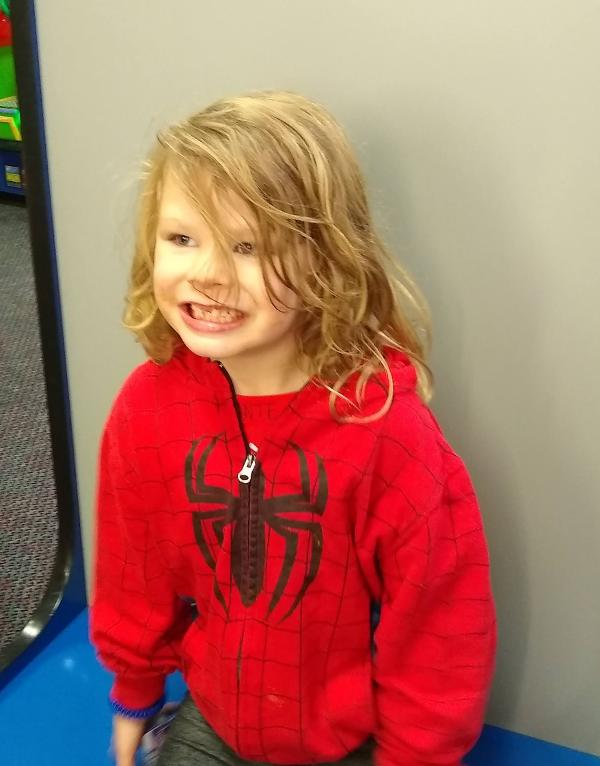

1. [StyleAnimation](#p-0)

# StyleAnimation

<iframe src=input_068660fb-ebe8-4288-93e6-4a2a8adf4004.html style="margin: 0px; resize: both; overflow: auto; width: 100%; height: 156px;"></iframe>

[Subreport: Painting](5e1b0d74-8f0f-4954-b370-64c1480f3009.html)
